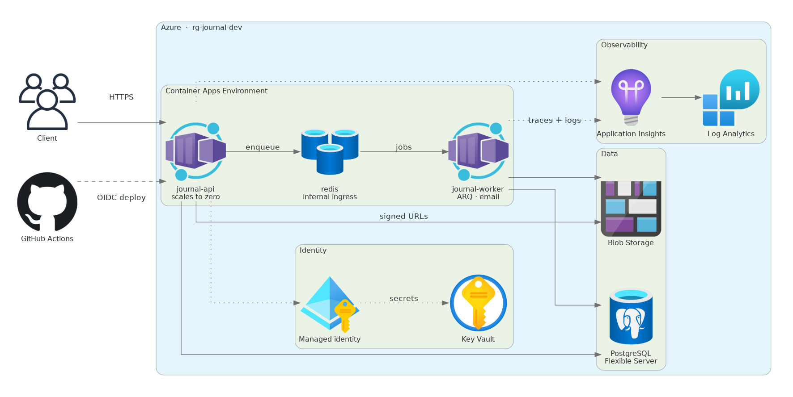

# Journal API

A private journaling API built with FastAPI and deployed to Azure Container Apps, with every piece of infrastructure defined in Terraform.

[](https://github.com/Akadir695/journal-api/actions/workflows/ci.yml)

**[Live API](https://journal-api.calmstone-34e3c129.uksouth.azurecontainerapps.io)** · **[Interactive docs](https://journal-api.calmstone-34e3c129.uksouth.azurecontainerapps.io/docs)**

> The first request may take a few seconds — the API scales to zero when idle and has to start.

---

## What this is

A working backend, taken past the point where it worked.

The application itself was functional in about three weeks. The rest of the time went on the things that turn code into a system someone could operate: containerisation, managed identity, secret management, structured logging, distributed tracing, alerting, and a deployment pipeline that refuses bad commits.

It is deliberately one project taken deep rather than several taken shallow. Everything described below is running, not planned.

---

## Architecture



Twenty-five Azure resources, all created by Terraform. Transactional email is sent by the worker through Resend, the only third-party service in the system.

The API scales to zero when idle. The worker and Redis hold a single replica each — the worker because ARQ polls a queue, Redis because the queue lives in memory. That choice is the single largest driver of running cost, which is covered below.

The dotted lines are worth reading: the application reaches Key Vault through a **managed identity**, and GitHub deploys through **OIDC**. Neither path involves a stored credential.

---

## Demo

Try it at **[/docs](https://journal-api.calmstone-34e3c129.uksouth.azurecontainerapps.io/docs)**.

Registration sends a verification code by email, delivered by a background worker through Resend. Once verified, login returns a short-lived access token and a refresh token with rotation and reuse detection — presenting an already-used refresh token revokes every token for that account.

The recording below picks up from an authenticated session: creating, listing, updating, soft-deleting and restoring entries.

<!-- VIDEO: drag the .mov into the GitHub README editor and paste the generated URL here -->

<!-- SCREENSHOTS


-->


---

## API

| Area | Endpoints |
|---|---|
| **Auth** | `POST /auth/register` · `login` · `refresh` · `logout` · `verify-email` · `forgot-password` · `reset-password` |
| **Entries** | `POST /entries` · `GET /entries` · `GET /entries/{id}` · `PATCH /entries/{id}` · `DELETE /entries/{id}` · `POST /entries/{id}/restore` |
| **Attachments** | `POST /attachments` · `GET /attachments` · `POST /attachments/{id}/confirm` · `GET /attachments/{id}` |
| **Exports** | `POST /exports` · `GET /exports/{id}` · `GET /exports/{id}/download` |
| **Stats** | `GET /stats/streak` · `GET /stats/summary` |
| **Tags** | `GET /tags` |
| **Users** | `GET /users/me` |
| **Health** | `GET /health` · `GET /health/ready` |

Notable behaviour:

- **Entries are soft-deleted** and can be restored. Nothing is destroyed on `DELETE`.
- **Full-text search** over entries using a PostgreSQL `tsvector` column maintained by a migration.
- **Attachments never pass through the API.** The client requests a signed URL, uploads directly to Blob Storage, then confirms. The API stores metadata only.
- **Exports run in the background.** `POST /exports` returns `202 Accepted`; the worker builds a zip, uploads it, and the download endpoint returns a short-lived signed URL.
- **Errors follow RFC 9457** problem details, with a consistent shape across every endpoint.
- **Rate limiting** is applied per IP in Redis, with a tighter limit on auth routes.

---

## Stack

| Layer | Choice | Why |
|---|---|---|
| API | FastAPI, Python 3.12 | async throughout, OpenAPI generated from types |
| Database | PostgreSQL 16 (Azure Flexible Server) | full-text search, and `asyncpg` is fast |
| ORM | SQLAlchemy 2.0 async + Alembic | typed models, versioned schema |
| Queue | ARQ over Redis | small, async-native, no Celery overhead |
| Auth | Argon2 + PyJWT | Argon2id for hashing, short access tokens with refresh rotation |
| Storage | Azure Blob Storage | direct client upload via signed URLs |
| Email | Resend | real delivery, no SMTP configuration |
| Logging | structlog | JSON in production, human-readable locally |
| Tracing | OpenTelemetry → Application Insights | vendor-neutral instrumentation |
| Infrastructure | Terraform (azurerm + azuread) | remote state in Azure Storage |
| CI/CD | GitHub Actions with OIDC | no cloud credentials stored anywhere |

---

## Infrastructure

Twenty-five Azure resources, all defined in `terraform/`:

- Resource group, PostgreSQL Flexible Server + database + firewall rules
- Container Apps Environment, three container apps (api, worker, redis)
- Storage account with a private container, shared key access disabled
- Key Vault with RBAC authorisation
- Log Analytics workspace and Application Insights
- A user-assigned managed identity, and seven role assignments
- An Entra app registration with a federated credential for GitHub Actions
- An action group and a log search alert rule

State is held remotely in an Azure Storage account, bootstrapped by hand — Terraform cannot store its own state in something it has not yet created.

### Rebuilt from scratch

On the last day the entire environment was destroyed and rebuilt from these files alone. It came back in roughly twenty minutes, and the exercise surfaced three things worth knowing:

1. **The alert rule and action group had been created in the portal** and were not in Terraform. They blocked the resource group deletion. Both are now defined in code.
2. **Azure creates resources you did not ask for.** Application Insights quietly added a Smart Detection action group and a portal dashboard, neither of which Terraform knew about.
3. **Four steps are not automated**, deliberately or otherwise — see [Known gaps](#known-gaps).

---

## Security

**No secret is stored anywhere it could be read.**

- **In Azure:** the application authenticates to Blob Storage with a user-assigned **managed identity**. Shared key access on the storage account is disabled entirely — `shared_access_key_enabled = false` — so the account keys do not work even if leaked. Signed URLs are produced with a **user delegation key** obtained from Entra ID rather than an account key.
- **In Key Vault:** the JWT secret, GHCR token and Resend API key are held in Key Vault and referenced by the container apps through the same managed identity. Their *values* are never in Terraform, so they never reach the state file.
- **In CI:** GitHub Actions authenticates to Azure with **OIDC federated credentials**. GitHub presents a short-lived token proving which repository and branch is running; Azure verifies it against a credential pinned to that exact repo and branch. There is no client secret to rotate or leak.
- **Least privilege:** the CI identity holds Contributor on the two container apps only — not on the resource group. It cannot reach the database, Key Vault or storage.
- **Secret scanning** runs in CI on every push, over the full commit history, and gates the build.

---

## Observability

Three questions, three queries. The KQL lives in the repo rather than in someone's browser history.

**Is anything actually broken?**

```kusto
requests
| where timestamp > ago(24h)
| summarize
    total = count(),
    client_errors = countif(toint(resultCode) between (400 .. 499)),
    server_errors = countif(toint(resultCode) >= 500)
  by name
| extend server_error_rate_pct = round(100.0 * server_errors / total, 2)
| order by server_error_rate_pct desc
```

The split matters. Application Insights marks any 4xx or 5xx as a failure, which conflates *"the client sent something wrong"* with *"the server broke"*. A 401 means authentication worked. Alerting on the combined number means being paged because someone mistyped a password.

**What is slow, and is it slow on purpose?**

```kusto
requests
| where timestamp > ago(24h)
| summarize p50 = percentile(duration, 50), p95 = percentile(duration, 95),
            p99 = percentile(duration, 99), count() by name
| order by p95 desc
```

Login sits around 390ms, and that is correct — Argon2 is deliberately slow so that stolen password hashes are expensive to attack. `/health/ready` shows a p50 of 8ms against a max of 185ms; that spread is cold start, the first request after a container wakes paying for new database and Redis connections.

**Which request should I go and look at?**

```kusto
requests
| where timestamp > ago(24h)
| top 20 by duration desc
| project timestamp, name, duration, resultCode, operation_Id
```

Every log line carries the trace id of its request, so an `operation_Id` from this query pulls back exactly what that one request did.

**Alerting:** a log search alert fires on any 5xx within a five-minute window and emails an action group. It is defined in Terraform, and it has been tested by stopping the database on purpose and watching the alert arrive.

---

## CI/CD

Every push runs four jobs:

```
test ──┐
       ├──> build ──> deploy
secrets ┘
```

| Job | Does | Gate |
|---|---|---|
| `test` | ruff, then 77 tests against real PostgreSQL, Redis and Azurite service containers, with an 85% coverage floor | blocks build |
| `secrets` | gitleaks over the full history | blocks build |
| `build` | builds for `linux/amd64`, tags with the full commit SHA, pushes to GHCR | main only |
| `deploy` | OIDC login, updates both container apps | main only |

**Images are tagged with the commit SHA**, never a mutable tag. The running container can always be traced to exactly one commit.

**Terraform is not in the pipeline.** Code deploys automatically; infrastructure changes are applied deliberately. A merged pull request should not be able to alter a database. `ignore_changes` on the container image declares the boundary: Terraform owns the shape of the system, CI owns which version runs.

The pipeline has been verified in both directions — a good commit reaching production, and a deliberately broken test leaving `build` and `deploy` skipped.

---

## Running locally

```bash
git clone https://github.com/Akadir695/journal-api.git
cd journal-api

cp .env.example .env          # fill in JWT_SECRET
docker compose up -d          # PostgreSQL, Redis, Azurite
uv sync
uv run alembic upgrade head
uv run uvicorn app.main:app --reload
```

`http://localhost:8000/docs`

### Tests

```bash
uv run pytest
```

77 tests, 89% coverage. They need PostgreSQL, Redis and Azurite running — `docker compose up -d` provides all three.

---

## Cost

Roughly **£2 per week** with the database stopped between sessions, or about £8–9 a month if left running.

| Service | Share |
|---|---|
| Azure Container Apps | ~48% |
| PostgreSQL Flexible Server | ~46% |
| Azure Monitor (full observability) | ~6% |
| Key Vault, Storage, bandwidth | < 1% |

The API itself costs almost nothing, because it scales to zero. The worker and Redis dominate compute despite doing very little, because they cannot. Observability — traces, logs, metrics and alerting — costs about twelve pence a week, which makes "it's too expensive to instrument" hard to defend.

---

## Known gaps

Things that are missing or compromised, and why.

**The database is publicly addressable.** It uses the Azure-services firewall rule (`0.0.0.0`–`0.0.0.0`), which permits connections from *any* resource in Azure, not only mine. Container Apps have no stable outbound IP, so there is no narrower rule available. The production answer is VNet integration with a private endpoint — on Flexible Server that is decided at creation and cannot be changed afterwards.

**Four steps are not automated.** Key Vault secret *values*, the database migration, and (until recently) the alert rule. Secrets are manual on purpose, so they never enter Terraform state. The migration is manual because it is not yet a pipeline step; it should run inside the deploy job before the new revision takes traffic.

**The GHCR token is the last stored credential.** Container Apps cannot pull from a private GitHub Container Registry using a managed identity, so a token is needed. Making the package public removes it entirely.

**Two tests need a live storage emulator.** The worker calls `get_storage()` directly rather than receiving it, so it cannot be given a fake. CI runs Azurite to compensate. The fix is to make storage injectable in the worker path.

**One environment.** `dev` is also production. The variable structure supports more, but the globally-unique resource names have `dev` baked in rather than interpolated. Separate `dev`/`staging`/`prod` with isolated state, a `CanNotDelete` lock on production, and plan review in pull requests would be the next step.

**No backup of blob contents.** Postgres has seven days of automatic backups; Blob Storage has no soft delete or versioning configured. Geo-redundant backup is off deliberately — it costs more, and there is no real data here.

**mypy does not pass.** Roughly fifty pre-existing errors. Better to say so than to claim a clean type check.

---

## Project structure

```
app/
  api/v1/routes/     endpoint handlers
  core/              config, security, storage, logging, rate limiting
  crud/              database operations
  db/models/         SQLAlchemy models
  schemas/           Pydantic request and response models
  workers/           ARQ background tasks
alembic/             database migrations
terraform/           all Azure infrastructure
tests/               77 tests
.github/workflows/   CI pipeline
```

---

## Notes

Built over 45 days as a structured learning project. The interesting parts were mostly the failures: telemetry that was accepted by Azure but never displayed because nothing was producing request spans; a coverage threshold that had never run because it was under the wrong TOML heading; tests that only passed because a storage emulator happened to be running on my laptop; and a Terraform configuration that would have silently reverted production to an older image.

Each of those is in the commit history.
