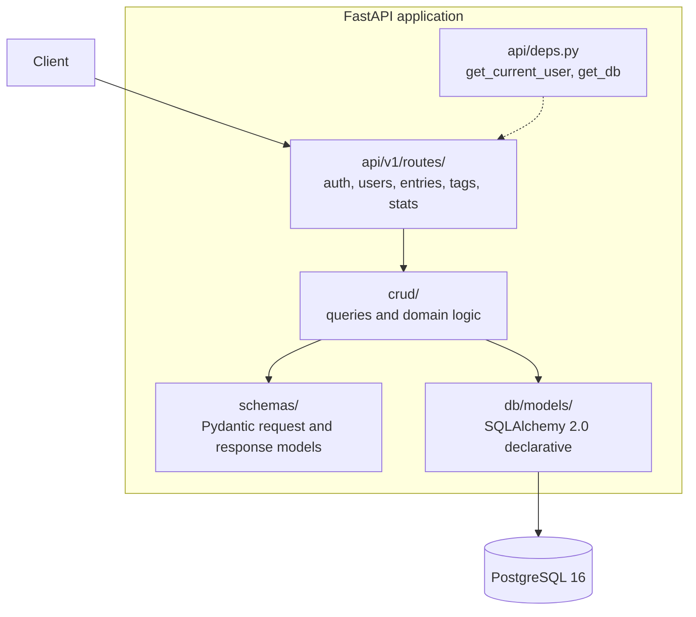
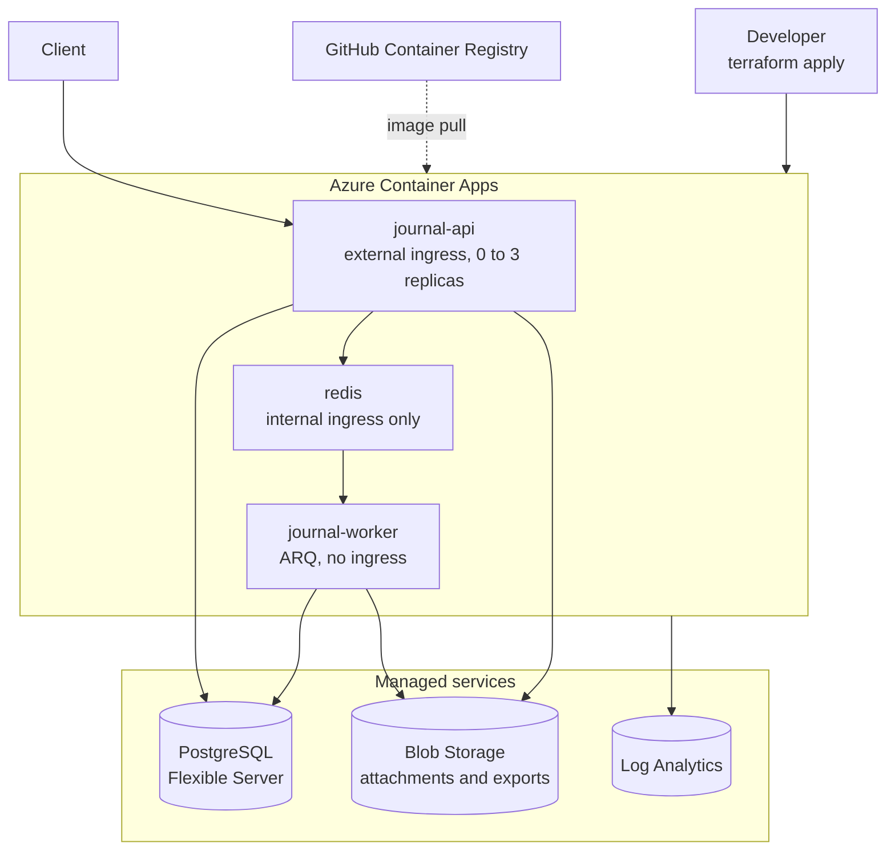

# Journal API

A private journaling backend. Users register, write dated entries, tag them, attach
images, search their history and see statistics about their habits. Built as an API
with no frontend, deployed to Azure Container Apps and provisioned entirely with
Terraform.

The point of the project was not the journaling. It was to build one service properly
end to end — from schema design through authentication, background jobs, containers,
infrastructure as code and production debugging — rather than a wider set of things
shallowly.

---

## What it does

| Area | Features |
|---|---|
| Auth | Register, email verification, login, JWT access tokens, refresh token rotation with reuse detection, logout, password reset |
| Entries | Create, read, update, soft-delete and restore. Every query scoped to the owning user |
| Organisation | Per-user tags, mood, favourites, separate entry date and created date |
| Discovery | Pagination, filtering by date range, mood, tag and favourite, and full-text search |
| Media | Image attachments uploaded straight to Blob Storage using short-lived signed URLs |
| Insights | Current and longest journaling streak, and a yearly summary of entry counts and moods. Cached in Redis and invalidated on write |
| Jobs | Background export to a zip of Markdown files, and transactional email |
| Platform | Rate limiting, caching, structured logging, health probes, RFC 9457 error responses |

It is a **JSON-only API**. There is no HTML anywhere, including in the auth flows —
verification and password reset emails contain codes rather than links, because a link
into a JSON endpoint cannot complete a flow that needs input. When a frontend exists,
the links point there instead.

---

## Architecture

How a request moves through the code:



Routes never touch the ORM; the data layer never touches `Request` or `Response`. That
separation is what made swapping an in-memory store for Postgres a contained change
early in the project, and what keeps the tests fast.

### Deployment



The API and the worker are the **same image** with different commands — one runs
`uvicorn`, the other runs `arq`. They never talk to each other directly: the API puts
jobs on Redis, the worker takes them off, and both read status from Postgres.

The API scales to zero when idle, so it costs nothing between requests. Redis and the
worker cannot, because nothing would wake them.

---

## Stack

| Concern | Choice | Why |
|---|---|---|
| Language | Python 3.12 | Modern typing, good async support |
| Framework | FastAPI + Pydantic v2 | Type hints drive parsing, validation and OpenAPI |
| Package manager | `uv` | Fast, with a real lockfile |
| Database | PostgreSQL 16 | Full-text search and JSONB without extra services |
| ORM | SQLAlchemy 2.0 (async) + `asyncpg` | 2.0 style is typed and visible to mypy |
| Migrations | Alembic | Version control for schema |
| Cache and queue | Redis 7 | Rate limits, caching and the job queue in one service |
| Background jobs | ARQ | Async-native, far simpler than Celery |
| Password hashing | Argon2 | Current best practice, not bcrypt |
| JWT | PyJWT | Maintained; `python-jose` is not |
| Object storage | Azure Blob Storage | Signed URLs keep large uploads off the API |
| Email | Resend | Simple HTTP API, no SMTP to operate |
| Testing | pytest, pytest-asyncio, httpx | In-process, no network |
| Lint and types | ruff + mypy | ruff replaces black, isort and flake8 |
| Container | Docker, multi-stage | 282 MB runtime image, non-root |
| Registry | GitHub Container Registry | Free, and already where the code lives |
| Infrastructure | Terraform | Cloud-agnostic; the skill transfers |
| Compute | Azure Container Apps | Serverless containers with scale-to-zero |

---

## Running it locally

Requires Docker and [uv](https://docs.astral.sh/uv/).

```bash
git clone https://github.com/Akadir695/journal-api.git && cd journal-api
cp .env.example .env          # then fill in the values
uv sync

docker compose up -d          # Postgres, Redis, Azurite
uv run alembic upgrade head

uv run uvicorn app.main:app --reload      # terminal 1
uv run arq app.workers.tasks.WorkerSettings   # terminal 2
```

Open http://localhost:8000/docs.

With no `RESEND_API_KEY` set, emails print to the worker's stdout instead of being
sent, so local development never emails anyone by accident.

### Tests

```bash
uv run pytest
uv run ruff check .
uv run mypy app
```

Tests run against a separate database inside a transaction that rolls back after each
test, so they are order-independent and leave nothing behind.

---

## Deploying

Infrastructure is defined in `terraform/`. One storage account for Terraform state was
created by hand — the bootstrap problem, since Terraform needs somewhere to write state
before it can create anything. Everything else is code.

```bash
# build and publish an image tagged with the commit it was built from
GIT_SHA=$(git rev-parse --short HEAD)
docker buildx build --platform linux/amd64 \
  -t ghcr.io/akadir695/journal-api:$GIT_SHA --load .
docker push ghcr.io/akadir695/journal-api:$GIT_SHA

cd terraform
terraform apply -var="image_tag=$GIT_SHA"
```

`--platform linux/amd64` matters when building on Apple silicon: without it the image
is arm64 and Container Apps refuses to start it.

The whole environment has been destroyed and rebuilt from code, which is the only real
proof that it is reproducible rather than merely described.

### Cost control

This runs on a personal pay-as-you-go subscription, so cost is a design constraint
rather than an afterthought:

- `min_replicas = 0` on the API — no traffic, no charge
- PostgreSQL stopped between sessions, which is the largest single lever
- Redis as a Container App rather than Azure Cache, which has no free tier
- GitHub Container Registry rather than ACR
- A budget with alerts at 50%, 80% and forecast 100%

The environment is destroyed between working sessions rather than left running, which
is what keeps this at pennies rather than £15–20 a month. Redis and the worker have to
stay awake while the environment exists, so leaving it up has a real floor.

---

## Known limitations

Deliberate trade-offs rather than oversights, and the next things to fix:

- **Secrets live in Terraform state.** State is a plaintext JSON blob, so the database
  password and storage keys are in it. It sits in a private container, but the correct
  fix is Key Vault with a managed identity, which is the next piece of work.
- **PostgreSQL is publicly reachable**, protected by firewall rules including the
  "allow Azure services" rule, which is broader than it sounds. Private networking with
  a VNet and private endpoints would remove the public endpoint entirely.
- **Email is restricted to the account owner.** Resend only permits sending to your own
  address until a domain is verified, so the deployed app can currently only email me.
- **No CI/CD.** Build, push and apply are run by hand. The steps are consistent enough
  now that automating them is straightforward, and that is planned.
- **Exports and attachments share one storage container.** They have different retention
  needs — attachments are permanent, exports are disposable — and should be separated.
- **Integer primary keys.** Sequential IDs are enumerable. Ownership scoping means no
  data leaks, but UUIDs would avoid disclosing how many records exist.

---

## Notes

A few decisions that took longer to reach than the code suggests:

**Exports are built in memory and uploaded to Blob Storage**, not written to disk. The
worker and the API run in separate containers with separate filesystems, so a file
written by one is invisible to the other — and container disks are ephemeral in any
case. The download endpoint returns a short-lived signed URL rather than redirecting to
one, so a client can inspect the URL and its expiry rather than being bounced somewhere
opaque.

**Refresh tokens rotate, and reuse triggers a full revocation.** Presenting a token that
has already been used means it was probably stolen, so every session for that user is
ended rather than just refusing the request.

**Failure paths return the same response.** `forgot-password` returns 202 whether or not
the address is registered, and requesting another user's entry returns 404 rather than
403. Both prevent using error responses to discover what exists.
